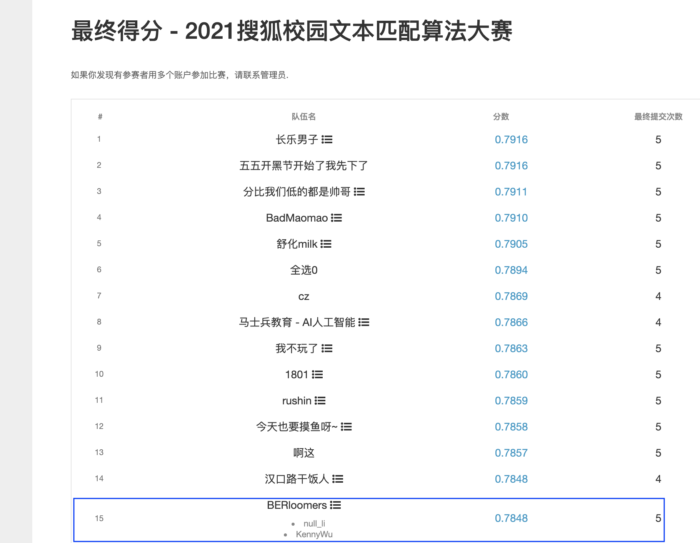
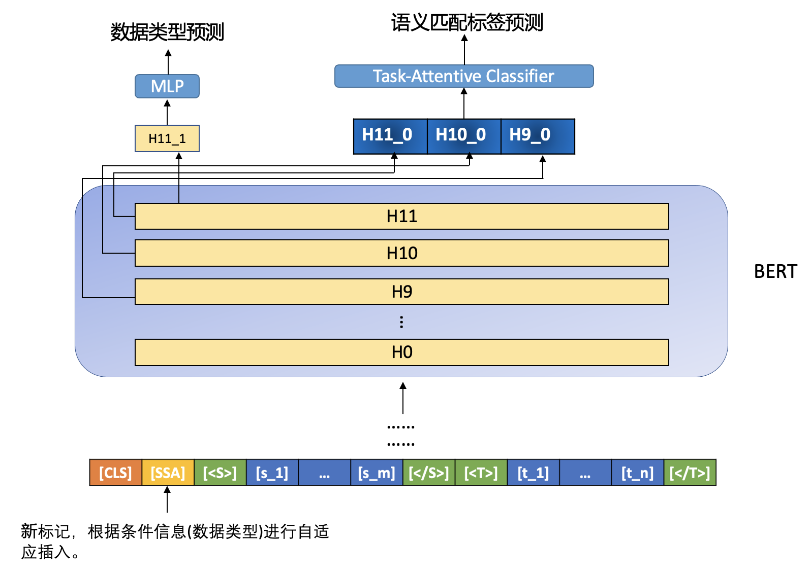
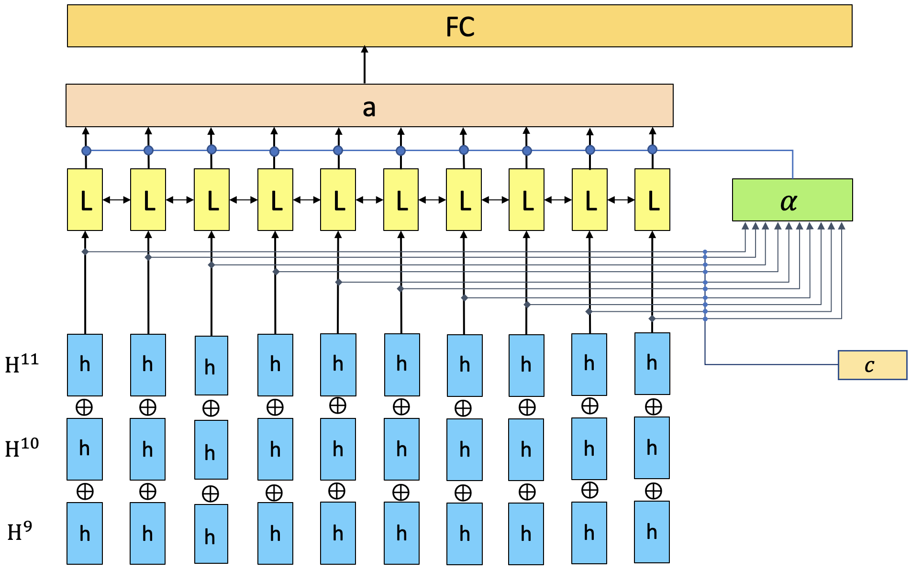

## 2021 搜狐校园文本匹配算法大赛方案
我们是初赛 Top9、复赛 Top15 的队伍 **BERloomers**，来自广西师范大学。
成员：KennyWu (kennywu96@163.com)、null_li (lizx3845@163.com)。
此次开源的方案是赛后重新设计的，线下验证集 F1 约为 0.7887。
根据复赛提交时线下验证集和线上测试集的误差，预估该开源方案的线上测试集 F1 约为 0.787 左右。
欢迎大家的交流与指正。


## 1. 方案分享

### 1.1 任务目标
参赛选手需要正确判断两段文字是否匹配，<a href="https://www.biendata.xyz/competition/sohu_2021/data/">数据</a>分为 A 和 B 两个文件，A 和 B 文件匹配标准不一样。其中 A 和 B 文件又分为“短短文本匹配”、“短长文本匹配”和“长长文本匹配”。
A 文件匹配标准较为宽泛，两段文字是同一个话题便视为匹配，B 文件匹配标准较为严格，两段文字须是同一个事件才视为匹配。

### 1.2 数据示例
```python
# A 类 短短 样本示例
{
    "source": "小艺的故事让爱回家2021年2月16日大年初五19：30带上你最亲爱的人与团团君相约《小艺的故事》直播间！",
    "target": "  香港代购了不起啊，宋点卷竟然在直播间“炫富”起来",
    "labelA": "0"
}

# B 类 短短 样本示例
{
    "source": "让很多网友好奇的是，张柏芝在一小时后也在社交平台发文：“给大家拜年啦。”还有网友猜测：谢霆锋的经纪人发文，张柏芝也发文，并且配图，似乎都在证实，谢霆锋依旧和王菲在一起，而张柏芝也有了新的恋人，并且生了孩子，两人也找到了各自的归宿，有了自己的幸福生活，让传言不攻自破。",
    "target": "  陈晓东谈旧爱张柏芝，一个口误暴露她的秘密，难怪谢霆锋会离开她", 
    "labelB": "0"
}
```

### 1.3 解题思路
为了从数据中学习到尽可能多的信息，同时又兼顾 A、B 以及三种小分类标准，我们的方案基于多任务学习的框架，共享一部分参数来进行表示学习，再设计任务特定的分类器来进行标签预测。

#### 1.3.1 模型设计
框架设计基于 BERT 的交互模型，通过 BERT 来得到 source-target pair 的向量表示。
本方案的整体结构如下图所示：


#### 1.3.2 文本编码
在本方案中使用最后 3 层的结果来进行下游任务的学习。
此外，针对此次比赛可划分为 6 个子任务的特点，我们引入了 Special Tokens 的概念。
- 提出了 6 种 Type Token 来引导文本的表示学习：
    | Token | 任务类型   |
    | --- | ------------|
    | SSA | 短短匹配 A 类 |
    | SSB | 短短匹配 B 类 |
    | SLA | 短长匹配 A 类 |
    | SLA | 短长匹配 A 类 |
    | LLA | 长长匹配 A 类 |
    | LLB | 长长匹配 A 类 |

- 使用`[<S>]、[</S>]`和`[<T>]、[</T>]`来分别区分 source 和 target。(相应的 special tokens 已经添加到 models/* 下所给的 vocab.txt 文件中)

#### 1.3.3 多任务学习
为了更好地学习`Type Token`的表示，并辅助`Task-Attentive Classifier`的学习，我们提出了数据类型标签预测任务，即根据`Type Token`的表示来判断当前输入属于哪种任务类型。

#### 1.3.4Task-Attentive Classifier
本着“和而不同”的思想，A、B 两个任务各独立使用一个的`Task-Attentive Classifier`，同时将 Type Token 的表示作为额外的条件信息传入`Classifier`进行 attention 计算，以获得 type-specific 的特征进行标签预测。


### 1.4 竞赛技巧

#### 1.4.1 数据划分
本方案中所使用的训练数据囊括『复赛所提供的训练集和初赛所提供的所有数据』，使用复赛提供的验证集来 evalute 模型的效果。


#### 1.4.2 模型融合
根据三个模型在线下验证集上的 F1 值设置了不同权重，同时通过**自动搜索**找到了最优的权重组合，得到线下。
本方案中所使用的`WoBERT`来自成员 KennyWu (本人) 客制的基于 pytorch 的预训练模型加载框架 <a href="https://github.com/KKenny0/torchKbert">torchKbert</a>，在此感谢追一科技开源的 <a href="https://github.com/ZhuiyiTechnology/WoBERT">WoBERT</a>。
| 模型               | 链接                       | 
| ------------------ | -------------------------- |
| BERT-wwm-ext       | https://github.com/ymcui/Chinese-BERT-wwm  |
| RoBERTa-wwm-ext | https://github.com/ymcui/Chinese-BERT-wwm   |
| WoBERT                | https://github.com/ZhuiyiTechnology/WoBERT |

#### 1.4.3 对抗训练、指数移动平均（EMA）和 Focal Loss

### 1.5 相比于复赛所提交方案的改进之处
本次开源的方案从**数据划分**、**模型结构**和**模型融合**三个方面对复赛提交方案进行改进。
- **数据划分**：扩大训练集，复赛提供的训练集-->复赛提供的训练集+初赛的所有数据。
- **模型结构**：重新设计了网络结构，改善了`Task-specific encoding`的方式。
- **模型融合**：复赛所提交方案使用`BERT-wwm-ext`和`ERNIE-1.0`进行模型融合。此方案则使用`BERT-wwm-ext`、`RoBERTa-wwm-ext`和`WoBERT`进行融合。

## 2. 复赛反思
复赛准备过程略显匆忙，最终复赛提交的方案存在许多不足。
因此在赛后我们将整个过程进行了复盘，并对方案进行了改进。
尽管复赛未能进 Top10，这次的比赛于我们而言仍是一次很好的经验。